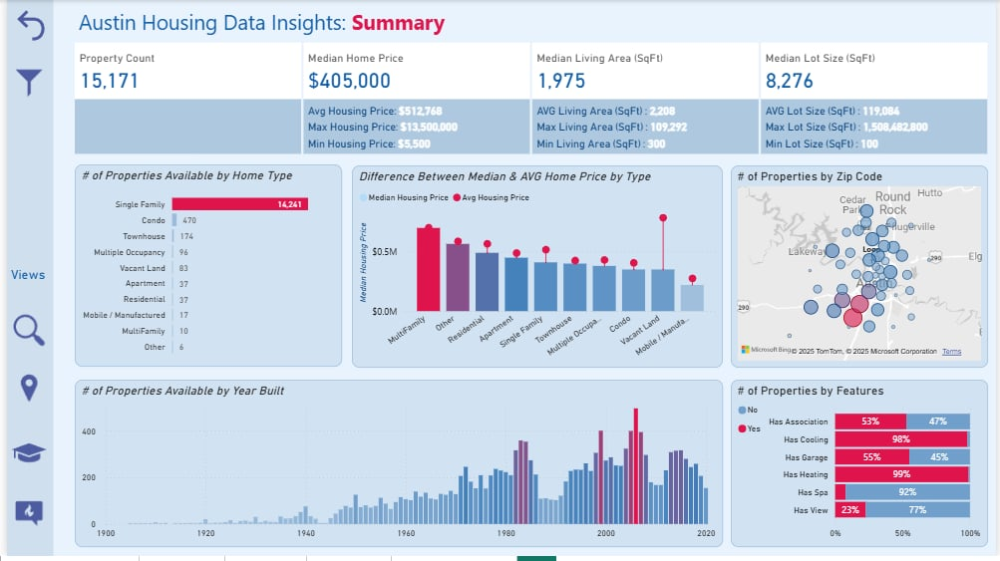
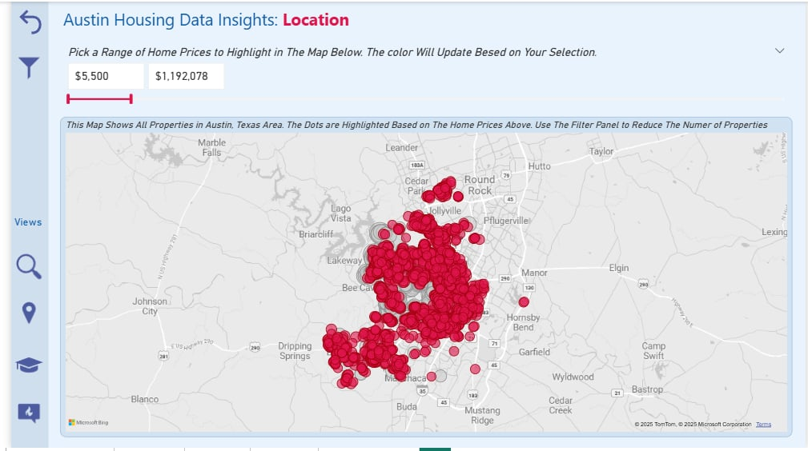
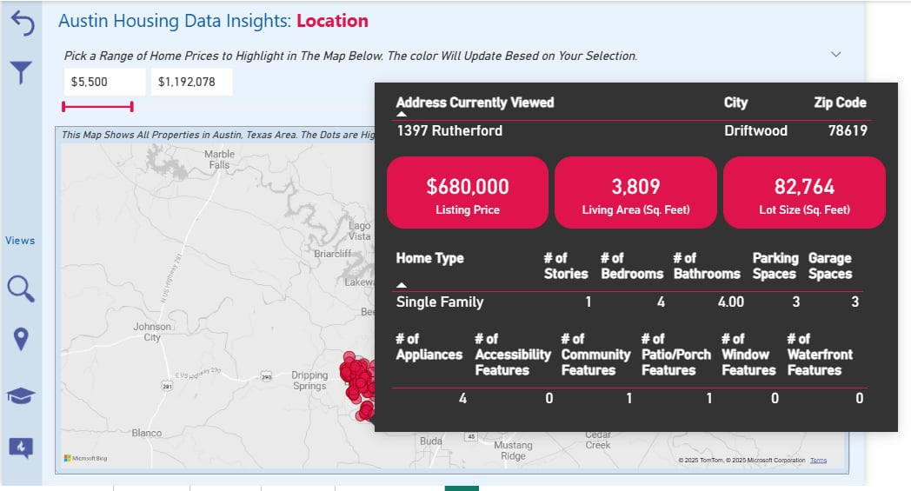
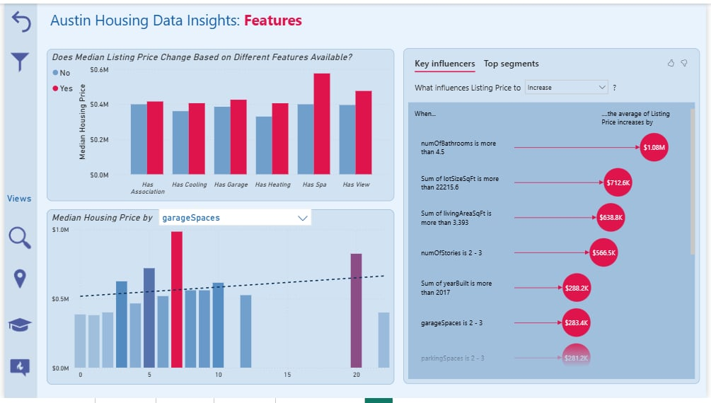
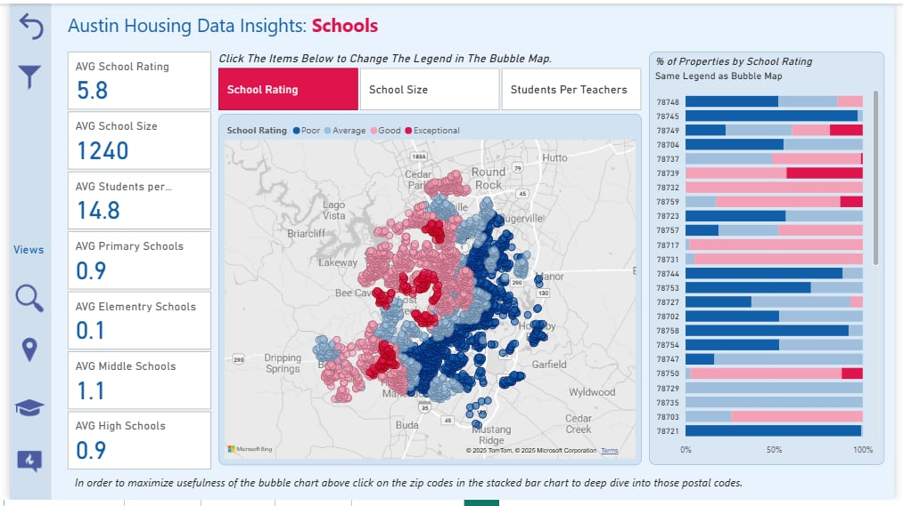

# Austin Housing Data Insights

An interactive Power BI dashboard analyzing 15,000+ Austin, TX housing listings to identify pricing trends and key value drivers.

- Built with **DAX**, **Power Query**, **KPI cards**, and **geospatial maps**
- Covers pricing, location, property features, and school quality

---

## Dashboard Views

### Summary

### Location

### Property Detail

### Features & Key Influencers

### Schools

